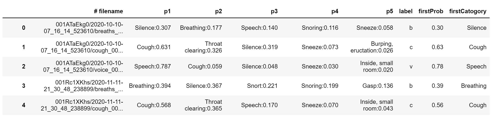
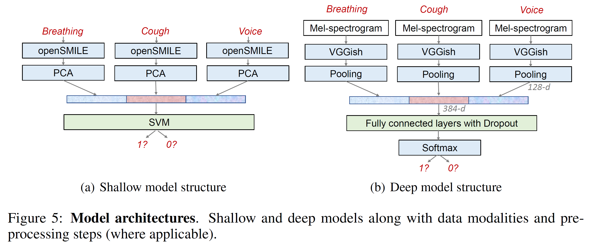
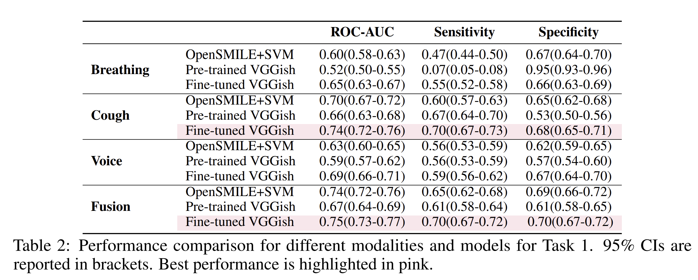
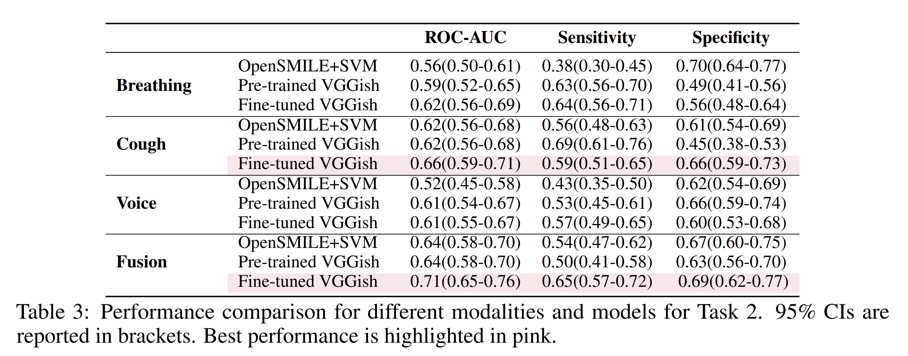

# covid19-sounds-NeurIPS2021
This repo contains the accompanying code for our submission *COVID-19 Sounds: A Large-Scale Audio Dataset for Digital COVID-19 Detection.*

## Dataset

As discussed in the paper, a DTA needs to be signed for full data access. The subsets used for the two main tasks are available upon reasonable request. Metadata and statistics can be seen in `statistics_all_platforms.ipynb`.

Contact: covid-19-sounds@cl.cam.ac.uk

## Code

Our models are implemented by Python3 with Tensorflow. We provide the necessary code to reproduce our results. 

Requirements: setup.py (requirements.txt)

### Automatic audio quality check

[Yamnet](https://www.tensorflow.org/hub/tutorials/yamnet) is deployed to detect whether a sample is of high-quality: it should contain breathing ('b'), cough ('c'), or voice ('v').  Silent and noisy samples will be labelled as `'n'` and will be excluded from further experiments.  We have already prepared the checklist `'results_raw_20210426_lan_yamnet_noloc.csv'` for all samples, but nevertheless we provide the code in case one wishes to follow a different data selection. 

`python ./YAMNet/Inference_save.py`

`python ./YAMNet/prediction_via_inference.py`

Example output as follows:

### Benchmark implementation

Transfer learning is applied to our tasks through a pre-trained CNN model named  [VGGish](https://modelzoo.co/model/audioset). For both tasks, we implemented three baselines: OpenSMILE+SVM, pre-trained VGGish, and a fine-tuned VGGish. A simple illustration of the methods is seen below:

### Task1: Respiratory symptom prediction
- OpenSMILE+SVM: 
  -   Go to the path `cd ./Respiratory_prediction/Opensmile`
  -   Extract features `python 1_extract_opensmile.py`
  -   Perform classification `python 2_classifcation.py`
- Pre-trained VGGish: 
  - Go to model's path `cd ./Respiratory_prediction/model`
  - Train the model `sh run_train_frozen.sh` 
  - Test the model `sh run_test_frozen.sh` 
- Fine-tuned VGGish: 
  - Go to model's path `cd ./Respiratory_prediction/model`
  - Train the model `sh run_train.sh` 
  - Test the model `sh run_test.sh` 
  
Results are summarisd in Table 2:

### Task2: COVID-19 prediction
- OpenSMILE+SVM: 
  -   Go to the path `cd ./COVID19_prediction/Opensmile`
  -   Extract features `python 1_extract_opensmile.py`
  -   Classification `python 2_classifcation.py`
- Pre-trained VGGish: 
  - Go to model's path `cd ./COVID19_prediction/COVID_model`
  - Train the model `sh run_train_frozen.sh` 
  - Test the model `sh run_test_frozen.sh` 
- Fine-tuned VGGish: 
  - Go to model's path `cd ./COVID19_prediction/COVID_model`
  - Train the model `sh run_train.sh` 
  - Test the model `sh run_test.sh` 

Results are summarised in Table 3:
  

### Issues

This code project is maintained by Tong Xia. For any questions, please contact me by tx229@cam.ac.uk.
